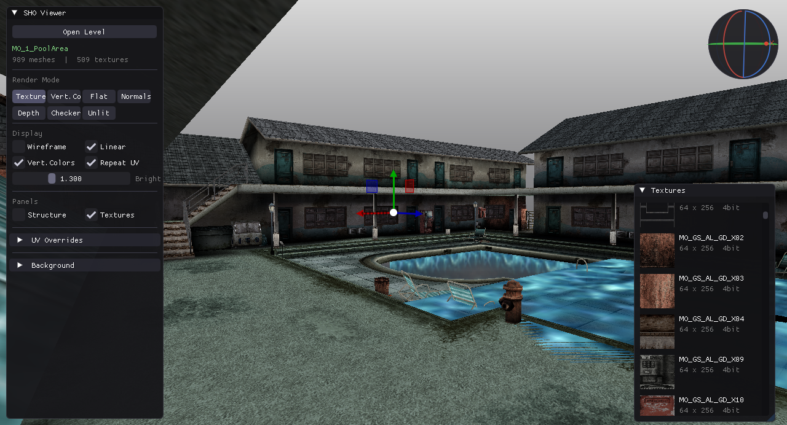
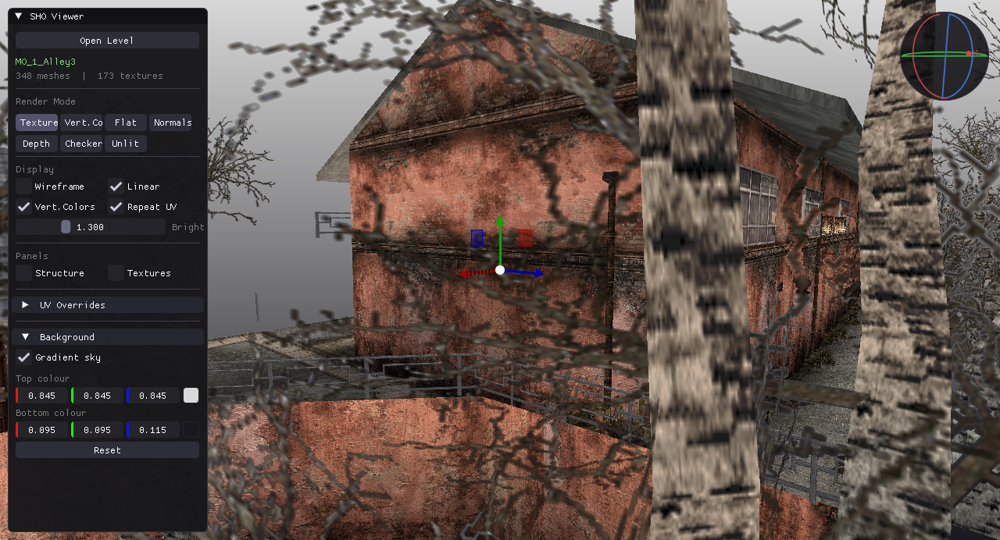

# Silent Hill Origins — 3D Level Viewer

A real-time 3D viewer for game levels and locations from **Silent Hill Origins** (PS2 / PSP),
with potential compatibility for **Silent Hill: Shattered Memories**.

Opens the proprietary `.sho` container format, decodes native PS2 textures, and renders the
full level geometry, baked lighting, collision mesh, and placed objects interactively.

> License: [CC BY 4.0](LICENSE) — free to use and modify, **attribution required**.

---

## Screenshots




---

## Features

- Parse and render SHO container files with embedded geometry, materials, and PS2 textures
- Decode native PS2 PSMT4 / PSMT8 / PSMCT32 texture formats via software unswizzle
- Seven render modes: Textured, Vertex Color, Flat Shaded, Normals, Depth, Checkerboard, Unlit
- Collision mesh overlay with optional semi-transparent fill
- Clump object markers (octahedron wireframe + projected labels)
- ImGuizmo translate gizmo for interactive pivot repositioning
- Orbit sphere gizmo for camera rotation with SDL cursor capture
- Structured hierarchy browser with section tree and material inspection
- Texture atlas browser with per-texture metadata
- File browser for loading levels at runtime

---

## Format Notes

The SHO container is a chunked binary format used by PS2 titles.
A top-level 0x071C directory block wraps named 0x0716 section records.
Each section may contain:

| Block type | Description                    |
|------------|--------------------------------|
| CLUMP      | RenderWare-style geometry tree |
| CBSP       | Collision BSP mesh             |
| TEXDICTION | Texture dictionary (TXD)       |
| BINMESH    | Pre-indexed triangle lists     |

See [SHO_FORMAT.md](SHO_FORMAT.md) for a detailed breakdown of the binary layout.

---

## Build

### Requirements

| Dependency | Notes                       |
|------------|-----------------------------|
| CMake 3.16 | or newer                    |
| GCC / Clang (C++17) |                  |
| OpenGL 3.3 | core profile                |
| GLEW       | `libglew-dev`               |
| SDL2       | `libsdl2-dev`               |
| GLM        | `libglm-dev` (header-only)  |

ImGui and ImGuizmo are downloaded automatically during the CMake configure step.

### CMake (recommended)

```bash
cmake -B build -DCMAKE_BUILD_TYPE=Release
cmake --build build -j$(nproc)
./build/SHOViewer path/to/level.sho [texture.txd ...]
```

### Makefile (local vendor/)

```bash
make -j$(nproc)
./SHOViewer path/to/level.sho [texture.txd ...]
```

---

## Usage

```
SHOViewer <level.sho> [txd1 txd2 ...]
```

Textures can be embedded inside the SHO file or supplied as separate TXD archives.
The file browser inside the application can also open files at runtime.

---

## Controls

| Action                  | Input                                    |
|-------------------------|------------------------------------------|
| Orbit camera            | Right-click drag / orbit sphere (top-right) |
| Zoom                    | Scroll wheel                             |
| Move pivot              | ImGuizmo translate arrows (drag XYZ)     |
| Reset camera            | Key **1** or **Reset Camera** button     |
| Open file               | Open Level button                        |

---

## Render Modes

| Mode         | Description                                   |
|--------------|-----------------------------------------------|
| Textured     | Albedo texture multiplied by vertex color     |
| Vert. Color  | Vertex color only, no texture                 |
| Flat         | Per-face normal shading via dFdx/dFdy         |
| Normals      | Face normals visualised as RGB                |
| Depth        | Linear depth in greyscale                     |
| Checker      | UV checkerboard (8x8 tiles)                   |
| Unlit        | Texture sampled without any color modulation  |

---

## Project Structure

```
src/
  main.cpp        — render loop, shaders, input
  Loader.cpp/h    — SHO/TXD parser, geometry upload
  UI.cpp/h        — structure tree, texture browser, file browser
  PS2Texture.cpp/h— PS2 VRAM format decoder
  Common.h/cpp    — shared state, types, globals
vendor/
  stb_image.h / stb_image_write.h
  json.hpp
  tiny_gltf.h
```

---

## License

[CC BY 4.0](LICENSE) — Copyright (c) 2026 BlackLineInteractive.
You are free to use, share, and adapt this code for any purpose **as long as you credit the author**.
